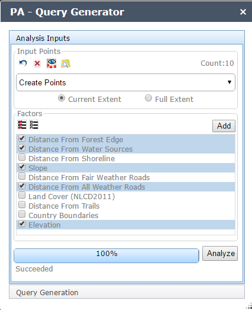

# Predictive Analysis - Query Generator
Overview txt

## Sections

* [Features](#features)
* [Requirements](#requirements)
* [Instructions](#instructions)
* [Using](#using)
* [Resources](#resources)
* [Issues](#issues)
* [Contributing](#contributing)
* [Licensing](#licensing)

## Features
* Query Generator Features txt

## Requirements
* Web AppBuilder for ArcGIS version 1.3
* One or more Image Services
* ArcGIS Predictive Analysis Web Services
  * ArcGIS for Server Advanced edition 10.4

## Instructions
* Download, install, and configure the ArcGIS Predictive Analysis Web Services.
* Configure the widget default geoprocessing service end points.
* Deploy the widgets to the client/stemapp/widgets folder of your Web AppBuilder for ArcGIS installation.

## Resources
[Web AppBuilder for ArcGIS](https://developers.arcgis.com/web-appbuilder/)

## Issues
Find a bug or want to request a new feature?  Please let us know by submitting an issue.

## Contributing
Esri welcomes contributions from anyone and everyone. Please see our [guidelines for contributing](https://github.com/esri/contributing).

If you are using [JS Hint](http://http://www.jshint.com/) there is a .jshintrc file included in the root folder which enforces this style.
We allow for 120 characters per line instead of the highly restrictive 80.

## Licensing
Copyright 2016 Esri

Licensed under the Apache License, Version 2.0 (the "License");
you may not use this file except in compliance with the License.
You may obtain a copy of the License at

   http://www.apache.org/licenses/LICENSE-2.0

Unless required by applicable law or agreed to in writing, software
distributed under the License is distributed on an "AS IS" BASIS,
WITHOUT WARRANTIES OR CONDITIONS OF ANY KIND, either express or implied.
See the License for the specific language governing permissions and
limitations under the License.

A copy of the license is available in the repository's
[license.txt](license.txt) file.

