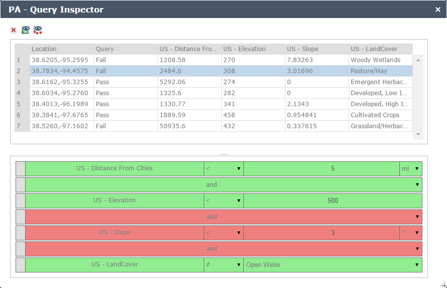
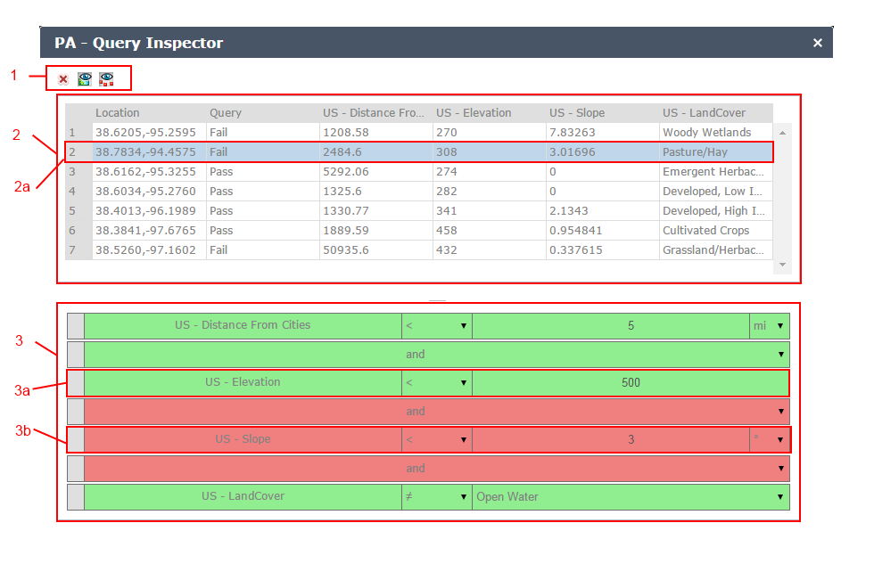

# Predictive Analysis - Query Inspector Widget
The Predictive Analysis Query Inspector Widget allows a user to inspect the results of a Query Editor Query operation to determine why specific area(s) passed or failed the query criteria.

## Sections

* [Features](#features)
* [Requirements](#requirements)
* [Instructions](#instructions)
* [Using](#using)
* [Resources](#resources)
* [Issues](#issues)
* [Contributing](#contributing)
* [Licensing](#licensing)

## Features
* Toggle query view
* Toggle visibility of query inspection map points
* Dynamically syncs with the last executed Query Editor Widget query operation
* Converts boolean query results to pass and fail

## Requirements
* Web AppBuilder for ArcGIS version 1.0 to 1.2
* Predictive Analysis Query Editor Widget

## Instructions
* Deploy the PA_QueryInspector widget to the client/stemapp/widgets folder of your Web AppBuilder for ArcGIS installation.

## Using

1. The Query Inspector Toolbar: From left to right the toolbar contains the following functions:
  * Delete All: Delete all query inspection results (points on map and rows in table)
  * View Query: Toggle the view a snapshot of the query editor - query associated with this analysis.
  * View Points: Toggle the visibility of the points on the map associated with the query inspection results.
2. Query Inspection Result Table: This is the main component of the widget.  Each time a location is clicked on the map a new row will be populated in this table.  
  * The table provides column(s) for:
      * each image service that is used in the query
      * the location of the query inspection
      * the overall query result
  * Figure 2a represents an example the currently selected query inspection result.  When a single query inspection is selected the query view will automatically display which clauses of the query passed or failed using red/green color highlighting.
3. Query View: Displays a view of the query editor query that is currently being used.
  * Figure 3a represents an example of a clause that has passed for the currently selected inspection result (fig. 2a)
  * Figure 3b represents an example of a clause that has failed for the currently selected inspection result (fig. 2a)     

## Resources
* [Web AppBuilder for ArcGIS] (https://developers.arcgis.com/web-appbuilder/)

## Issues
* Find a bug or want to request a new feature?  Please let us know by submitting an issue.

## Contributing
Esri welcomes contributions from anyone and everyone. Please see our [guidelines for contributing](https://github.com/esri/contributing).

If you are using [JS Hint](http://http://www.jshint.com/) there is a .jshintrc file included in the root folder which enforces this style.
We allow for 120 characters per line instead of the highly restrictive 80.

## Licensing
Copyright 2014 Esri

Licensed under the Apache License, Version 2.0 (the "License");
you may not use this file except in compliance with the License.
You may obtain a copy of the License at

   http://www.apache.org/licenses/LICENSE-2.0

Unless required by applicable law or agreed to in writing, software
distributed under the License is distributed on an "AS IS" BASIS,
WITHOUT WARRANTIES OR CONDITIONS OF ANY KIND, either express or implied.
See the License for the specific language governing permissions and
limitations under the License.

A copy of the license is available in the repository's
[license.txt](license.txt) file.

