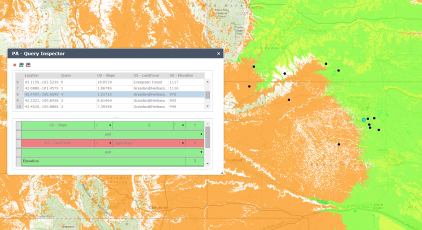

# Predictive Analysis Web
The Predictive Analysis Web Solution includes a set of ArcGIS Web AppBuilder compliant JavaScript widgets for performing rapid predictive site suitability and mobility analysis. These tools allow you to build models to predict the location of moving or stationary targets or events.

## Sections

* [Features](#features)
* [Requirements](#requirements)
* [Instructions](#instructions)
* [Resources](#resources)
* [Issues](#issues)
* [Contributing](#contributing)
* [Licensing](#licensing)

## Features
* Run queries and visualize their results within seconds.
* Build human readable queries against a set of available image service inputs.
* Take a set of observations and use the characteristics of their locations to find what other areas have similar qualities.
* Make binary or weighted queries.
* Inspect query results to ascertain how and why particular locations passed, failed, or were given a particular weight.

## Requirements
* ArcGIS Server Advanced Edition version 10.2 - 10.4.1
	* Requires the .NET Extension Support feature
* Web AppBuilder for ArcGIS Developer Edition version 2.0 - 2.1

## Instructions
###### Deploy ArcGIS Predictive Analysis Geoprocessing Services
* Run the setup executable on the machine running ArcGIS for Server.
* Publish the services:
	* For the ExecuteQuery geoprocessing service:
		1.  Log into ArcGIS Server Manager
		2.  Click the **Publish Service** button
		3.  Click the **Choose File** button
		4.  Navigate to ArcGIS Predictive Analysis Web Tool Servcies installation folder. The default installation path is *C:\Program Files\ArcGIS\Predictive Analysis
		5.  Select the ExecuteQuery.sd file
		6.  Click the **Next** button
		7.  Specify service properties
			* Select the name of the service
			* Select the sub folder, if any, you would like to publish to
			* Select the deployment cluster
		8. Click the **Next** button
		9. Click the **Publish** button
			* **Note:** If ArcGIS Server is federated with Portal you will be prompted to set sharing properties on the portal item that will be created when the service is published. If the service is not shared, access will be limited to the account that published the service.
	* For the AnalyzeQueryFactors geoprocessing service follow the above steps, selecting the AnalyzeQueryFactors.sd file instead.

	* **Note:** Geoprocessing services may receive image service credential tokens as part of the input parameter to open secure image services. Due to this, it is recommended that you serve and consumer these services through the https protocol.

###### Installing the Web AppBuilder for ArcGIS Widgets
* Deploy the widgets to the machine hosting the Web AppBuilder for ArcGIS Developer Edition. To do this, copy the contents of the entire folder for each widget to the directory listed below:
	* **<web-appbuilder-install-path>\client\stemapp\widgets**
* It is highly recommended that you edit the default geoprocessing services that the Query Editor and Query Generator widgets use. This prevents web application authors from having to manually specify the service REST url for the Query Editor and Query Generator widgets each time an pplication is created. To do this follow the instructions below:
	* For the Query Editor Widget
		1. On the machine hosting Web AppBuilder for ArcGIS Developer Edition, navigate to the following folder:
			* <web-appbuilder-install-path>\client\stemapp\widgets\PA_QueryEditor
		2. Open 'config.json' file in a text editor
		3. Change the gpServiceUrl parameter to point to the geoprocessing services that was published eariler. The url should have the following structure:
			* https://<arcgis-server-base-url>/<web-adaptor-name>/rest/services/<sub-folder>/<service-name>/GPServer/ExecuteQueryModel
			* If you do not have a web adaptor installed the url should have the following structure:
				* https://arcgis-server-base-url:6442/arcgis/rest/services/<sub-folder>/<service-name>/GPServer/ExecuteQueryModel
			* If you installed the service in the root folder, omit the sub-folder part of the url
			* The default service name is 'ExecuteQuery'
		4. Save the file

	* For the Query Generator Widget
		1. On the machine hosting Web AppBuilder for ArcGIS Developer Edition, navigate to the following folder:
			* <web-appbuilder-install-path>\client\stemapp\widgets\PA_Generator
		2. Open 'config.json' file in a text editor
		3. Change the gpServiceUrl parameter to point to the geoprocessing services that was published eariler. The url should have the following structure:
			* https://<arcgis-server-base-url>/<web-adaptor-name>/rest/services/<sub-folder>/<service-name>/GPServer/AnalyzeQueryFactorsModel
			* If you do not have a web adaptor installed the url should have the following structure:
				* https://arcgis-server-base-url:6442/arcgis/rest/services/<sub-folder>/<service-name>/GPServer/AnalyzeQueryFactorsModel
			* If you installed the service in the root folder, omit the sub-folder part of the url
			* The default service name is 'AnalyzeQueryFactors'
		4. Save the file

## Resources
[Web AppBuilder for ArcGIS](https://developers.arcgis.com/web-appbuilder/)

## Issues
Find a bug or want to request a new feature?  Please let us know by submitting an issue.

## Contributing
Esri welcomes contributions from anyone and everyone. Please see our [guidelines for contributing](https://github.com/esri/contributing).

If you are using [JS Hint](http://http://www.jshint.com/) there is a .jshintrc file included in the root folder which enforces this style.
We allow for 120 characters per line instead of the highly restrictive 80.

## Licensing
Copyright 2016 Esri

Licensed under the Apache License, Version 2.0 (the "License");
you may not use this file except in compliance with the License.
You may obtain a copy of the License at

   http://www.apache.org/licenses/LICENSE-2.0

Unless required by applicable law or agreed to in writing, software
distributed under the License is distributed on an "AS IS" BASIS,
WITHOUT WARRANTIES OR CONDITIONS OF ANY KIND, either express or implied.
See the License for the specific language governing permissions and
limitations under the License.

A copy of the license is available in the repository's
[license.txt](license.txt) file.

